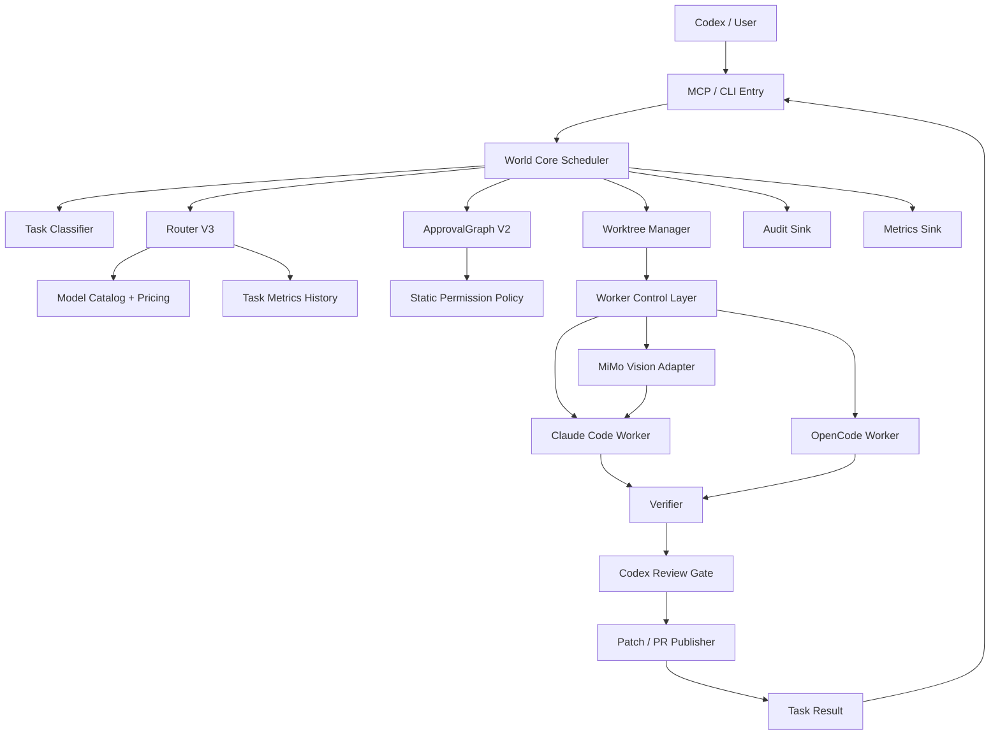

# WORLD 系统最高标准落地方案（结合当前实际）

生成时间：2026-06-28  
依据文件：`C:\Users\fujunye\Downloads\deep-research-report (5).md`  
当前系统目录：`C:\Users\fujunye\Documents\Codex\2026-06-24\li\outputs\ai-orchestrator-v1`  
目标业务项目：`C:\Users\fujunye\Desktop\Agent\04-rag-ecommerce`

> 本方案已完整阅读研究报告后重新设计。报告里的很多“未指定项”在当前实际系统中已经有答案，因此本方案不是复述报告，而是把报告的高标准原则落到当前代码、配置、压测结果和已暴露缺陷上。

## 1. 当前实际基线

### 1.1 已经具备的能力

当前 WORLD 系统不是纯设计稿，已经具备真实执行能力：

- `ai-dispatcher submit-task` 可创建真实任务。
- World-enabled 项目会优先走 World plan route。
- 任务状态持久化到 `C:\Users\fujunye\.ai-orchestrator\state.sqlite`。
- 任务产物写入 `C:\Users\fujunye\.ai-orchestrator\runs\<task_id>\`。
- 业务 repo 使用 git worktree 隔离执行。
- WSL 侧 worker 已验证：
  - `claude` 可用。
  - `opencode` 可用。
- Provider 已真实验证：
  - `deepseek-v4-flash` 可用。
  - `deepseek-v4-pro[1m]` 可用。
  - `mimo-v2.5` 可用。
  - `mimo-v2.5-pro` 可用。
  - MiMo V2.5 多模态 API 可用，可识别 base64 PNG 图片。
- OpenCode + GLM 5.2 已完成真实补丁任务。
- Claude Code + DeepSeek Pro 已完成真实补丁任务。
- 全量 orchestrator 回归当前为 `233 passed`。

### 1.2 当前有效成功压测记录

| task_id | 组合 | 状态 | 结论 |
|---|---|---|---|
| `t_20260628_160740_03ae76` | `claude_code + deepseek_pro` | `COMPLETED_WITH_PATCH` | 完整闭环成功，build passed true |
| `t_20260628_153357_829a88` | `claude_code + deepseek_flash` | `COMPLETED_WITH_PATCH` | 先失败但有 diff，后经恢复机制修正 |
| `t_20260628_130925_e5e26d` | `opencode + GLM 5.2` | `COMPLETED_WITH_PATCH` | OpenCode 真实 worker 成功 |

### 1.3 当前已修复的关键问题

当前系统已经完成了研究报告中部分 P0/P1 建议：

- Claude worker 失败但有 diff 时不再丢补丁。
- Scheduler 支持 `failed + changed_files` 进入 verify/review。
- Scheduler 已检查 `build_passed`，不会再把 build 失败任务误标完成。
- Claude worker `max_turns` 从固定 12 改为 route 可配置，默认 20。
- Claude prompt 已说明 World Core 负责最终验证，避免 worker 浪费回合跑完整测试。
- `04-rag-ecommerce` build command 已改为：

```text
cd apps/backend && uv run --no-project python -m compileall app
```

- Claude Code provider 改为 per-task env profile。
- OpenCode 不注入 provider key，直接调用 OpenCode CLI。
- DeepSeek/MiMo 的 WSL profile 已可用。

## 2. 研究报告核心思想与实际差距

研究报告的核心判断正确：

> WORLD 不应升级成更大的一坨调度器，而应升级为控制面/执行面分离、平台内核/可插拔扩展分层、策略/权限/审计/成本显式建模的工程平台。

结合当前实际，差距如下。

| 报告要求 | 当前实际 | 差距 |
|---|---|---|
| 基线清单 source-of-truth | 部分存在，状态库/配置/产物可读 | 缺正式 `baseline_inventory.md` |
| 静态 worker 权限 | 部分硬编码，OpenCode/Claude 已有边界 | 缺 `worker_permissions.yaml` 和统一执行前检查 |
| ApprovalGraph 输入 WARN、真实风险 BLOCK | 仍需核查和改造 | 分类/审批仍可能误判关键词 |
| Router 成本/成功率感知 | 现在主要是规则和 override | 缺 metrics 驱动 |
| MCP tool registry/schema | CLI/MCP 存在，但 registry 未统一 | 缺 schema、错误码、alias 版本治理 |
| verify/review/publish 统一门禁 | build gate 已修 | 缺 `verify/verify.json`、review 权限问题仍在 |
| audit/observability | 有 DB events 和 artifacts | 缺统一 audit schema、metrics 表、OTel |
| World Console | 还未正式落地 | 需在 schema 稳定后做 |
| 多模态 | MiMo API 验证通过 | 未接入 World task pack |

## 3. 总体设计目标

最高标准落地目标不是“更多自动化”，而是：

1. 可解释：每次路由、审批、失败、升级都有结构化原因。
2. 可验证：每个完成任务都有 diff、verify、review、publish 证据。
3. 可回滚：每个任务可恢复状态、清理 worktree、保留 correction event。
4. 可审计：关键动作 100% 进入 audit sink。
5. 可控成本：每个 attempt 都记录 tokens、turns、cost、duration。
6. 可扩展：模型、worker、MCP tools、UI 均通过 schema 和配置扩展。
7. 永不自动 merge：PR/patch 可以创建，但 merge 永远由人控制。

## 4. 推荐目标架构



关键边界：

- Scheduler 只负责编排，不直接写风险规则。
- Router 只输出 route，不执行任务。
- ApprovalGraph 只决定审批模式，不改 route。
- Worker 只改 worktree，不写 DB，不 push，不 merge。
- Verifier/Reviewer 是完成任务前的硬门禁。
- UI 只能通过 MCP/CLI 调用服务端，不直接执行 shell。

## 5. 分阶段落地方案

### Phase 0：冻结真实基线

目标：把当前系统事实固化为单一可信源，避免继续靠记忆和散落日志判断。

交付物：

- `docs/baseline_inventory.md`
- `docs/current_runtime_inventory.md`
- `docs/model_provider_smoke_tests.md`
- `docs/task_outcome_baseline.md`
- `schemas/current_state_schema.json`

具体任务：

1. 扫描 `orchestrator/` 下 CLI、MCP、worker、scheduler、router、approval、verifier、reviewer 文件。
2. 读取 `C:\Users\fujunye\.ai-orchestrator\projects.yaml`、`models.yaml`、`policies.yaml`。
3. 从 `state.sqlite` 导出最近 50 个任务的状态、模型、worker、结果。
4. 汇总 `runs/*/result.json`、`final.md`、`verify/*`。
5. 记录当前有效模型：
   - DeepSeek flash/pro
   - MiMo V2.5/V2.5 Pro
   - OpenCode GLM 5.2
6. 标记历史误判任务，如 `t_20260628_160338_4a511e`。

验收标准：

- 可以从一份 Markdown 和一组 JSON 文件恢复当前系统认知。
- 任何“已支持/未支持”都有证据路径。
- 不输出任何 API key。

建议优先级：最高。

### Phase 1：结构化 Verify 与 Metrics

这是当前最应该先做的工程改造，因为它直接支撑后续路由学习、成本控制和审计。

#### 1.1 新增 `verify/verify.json`

当前缺陷：

- 有 `build.log`、`changed_files.json`、`diff.patch`。
- 缺少稳定的结构化 verify 结果。

目标 schema：

```json
{
  "tests_passed": true,
  "build_passed": true,
  "forbidden_allowed": true,
  "commands": [
    {
      "kind": "build",
      "command": "cd apps/backend && uv run --no-project python -m compileall app",
      "returncode": 0,
      "duration_sec": 1.23,
      "log_path": "verify/build.log"
    }
  ],
  "changed_files": ["apps/backend/app/services/reranker.py"],
  "diff_path": "verify/diff.patch",
  "finished_at": "..."
}
```

实现点：

- 修改 `orchestrator/verifier.py`。
- Scheduler 每次 verify 后写 `verify/verify.json`。
- `final.md` 从 `verify.json` 渲染，而不是散落字段。

测试：

- build 失败时 `build_passed=false`。
- tests 为空时 `tests_passed=true`，但必须显式写入。
- forbidden path 命中时 `forbidden_allowed=false`。

#### 1.2 新增 `metrics.json` 与 `task_metrics` 表

当前缺陷：

- 成本在 `worker.stream.jsonl` 中。
- DB 不知道每个 attempt 的 cost、turns、tokens。

新增表建议：

```sql
CREATE TABLE IF NOT EXISTS task_metrics (
  task_id TEXT,
  attempt_no INTEGER,
  worker TEXT,
  model TEXT,
  status TEXT,
  failure_reason TEXT,
  total_cost_usd REAL,
  duration_ms INTEGER,
  duration_api_ms INTEGER,
  num_turns INTEGER,
  input_tokens INTEGER,
  output_tokens INTEGER,
  cache_read_input_tokens INTEGER,
  changed_files_count INTEGER,
  build_passed BOOLEAN,
  review_approved BOOLEAN,
  created_at TEXT,
  PRIMARY KEY(task_id, attempt_no)
);
```

实现点：

- 新增 `orchestrator/metrics.py`。
- 从 Claude/OpenCode stream 解析 result event。
- 写 `runs/<task>/metrics.json`。
- 写 `task_metrics`。

验收标准：

- `deepseek_flash` 的 `error_max_turns_no_diff` 能在 metrics 中统计。
- `deepseek_pro` 的成功补丁成本能直接查询。
- 后续 Router 可读 metrics。

### Phase 2：Failure Reason 分类器

当前真实压测已经暴露多种失败：

- `auth_failed`
- `error_max_turns_no_diff`
- `error_max_turns_with_diff`
- `command_missing`
- `build_failed`
- `review_unavailable`
- `forbidden_path`
- `worker_no_diff`

新增模块：

```text
orchestrator/failure_classifier.py
```

目标输出：

```json
{
  "failure_reason": "max_turns_no_diff",
  "retryable": true,
  "recommended_action": "escalate_model_or_narrow_task",
  "evidence": ["result.subtype=error_max_turns", "changed_files=[]"]
}
```

调度策略：

| failure_reason | 调度动作 |
|---|---|
| `auth_failed` | 立即停止，提示配置 |
| `max_turns_no_diff` | 如果是 flash，升级 pro；如果是开放任务，先 analyzer |
| `max_turns_with_diff` | 进入 verify |
| `command_missing` | 停止，生成配置修复建议 |
| `build_failed` | 停止或交给 repair route |
| `review_unavailable` | medium+ 风险进入 `NEEDS_USER` |
| `forbidden_path` | BLOCK |

验收标准：

- 所有 `FAILED_FINAL` 都有 failure_reason。
- 不再出现只有 `all_attempts_failed` 而没有具体原因的任务。

### Phase 3：Router V3 和 Task Shape

当前实际结论：

- `deepseek_flash` 可用，但不适合开放式找 bug。
- `deepseek_pro` 对明确小修复很稳。
- `opencode + GLM 5.2` 适合复杂或 fallback。
- MiMo 多模态 API 可用，但还未接入 World task pack。

因此 Router 不应只看关键词，应先识别 `task_shape`。

建议 task_shape：

```text
targeted_patch
open_bug_hunt
docs_update
test_generation
large_refactor
multimodal_analysis
multimodal_to_code
config_repair
review_only
```

默认路由：

| task_shape | 首选 | fallback |
|---|---|---|
| `targeted_patch` | DeepSeek Pro | DeepSeek Flash 或 OpenCode high |
| `open_bug_hunt` | Codex analyzer + DeepSeek Pro | OpenCode GLM high/max |
| `docs_update` | DeepSeek Flash | DeepSeek Pro |
| `test_generation` | DeepSeek Pro | OpenCode GLM high |
| `large_refactor` | OpenCode GLM max | manual approval |
| `multimodal_analysis` | MiMo V2.5 direct adapter | MiMo V2.5 Pro |
| `multimodal_to_code` | MiMo analysis + DeepSeek Pro patch | OpenCode fallback |

Router V3 输入：

```json
{
  "task_shape": "targeted_patch",
  "risk_level": "medium",
  "target_paths": ["apps/backend/app/services/reranker.py"],
  "budget_cap_usd": 1.0,
  "history": {
    "deepseek_flash": {"success_rate": 0.2, "avg_cost": 1.0},
    "deepseek_pro": {"success_rate": 0.9, "avg_cost": 0.3}
  }
}
```

Router V3 输出：

```json
{
  "selected_worker": "claude_code",
  "selected_model": "deepseek_pro",
  "reason": "targeted backend patch; flash has recent max_turns_no_diff failures",
  "retry_chain": [
    {"worker": "claude_code", "model": "deepseek_pro"},
    {"worker": "opencode", "model": "opencode-go/glm-5.2", "variant": "high"}
  ],
  "budget_estimate_usd": 0.45
}
```

验收标准：

- “Find one bug and fix it” 不再直接交给 flash 开放探索。
- 明确单文件修复可走 pro 或 flash。
- 路由原因必须引用 task_shape、历史成功率、预算。

### Phase 4：ApprovalGraph V2 与静态 Worker 权限

研究报告的 P0 在当前系统仍然成立。

#### 4.1 ApprovalGraph V2

原则：

- 输入中的敏感词只产生 warning。
- 真实危险命令、真实危险路径、真实 diff 才 BLOCK 或 HARD_APPROVAL。

示例：

| 场景 | 结果 |
|---|---|
| `fix auth bug` | WARN，不 BLOCK |
| `update product page` | 不因 `prod` 子串误伤 |
| 写 `.env` | BLOCK |
| 改 `infra/prod/**` | HARD_APPROVAL |
| 执行 `rm -rf /` | BLOCK |
| 尝试 `git push --force` | BLOCK |

#### 4.2 `worker_permissions.yaml`

建议文件：

```text
config/worker_permissions.yaml
```

关键设计：

- Claude/OpenCode 默认同权限，不因模型强弱放宽危险写权限。
- MiMo 多模态 adapter 默认只读图片和目标上下文，不直接写业务代码。
- `allow/ask/deny` 三层。

执行点：

- Worker 启动前检查 prompt/task 声明路径。
- Worker shell 命令执行前检查。
- Worker 完成后检查 diff。

验收标准：

- 权限配置有 schema。
- 权限命中写 audit event。
- Worker 无法绕开禁止路径。

### Phase 5：MCP Tool Registry 与 Schema

当前系统有 CLI 和 MCP，但缺少统一 registry。

新增：

```text
orchestrator/tool_registry.py
schemas/task_status.json
schemas/route_decision.json
schemas/approval_decision.json
schemas/error_envelope.json
schemas/verify_result.json
schemas/metrics_result.json
```

每个 tool 必须声明：

- name
- aliases
- inputSchema
- outputSchema
- annotations
- idempotency
- audit action
- error codes

建议保留旧名字：

- `submit-task`
- `get-task-status`
- `read-task-result`

新增 canonical World tools：

- `world.submit_current_project_task`
- `world.get_task_status`
- `world.read_task_result`
- `world.get_task_control`
- `world.cancel_task`
- `world.rollback_task`
- `world.explain_route`
- `world.explain_approval`
- `world.open_task_artifacts`
- `world.repair_task_status`

验收标准：

- CLI/MCP/未来 World Console 共用同一 schema。
- 新旧 alias 至少共存一个版本周期。
- 每个错误都有机器可读 `error_code`。

### Phase 6：Codex Review Gate 修复

当前真实压测出现：

```text
codex review unavailable; used local gate: [WinError 5] 拒绝访问。
```

这说明 review fallback 可用，但不是最高标准。

目标：

- low 风险：local gate 可以 fallback。
- medium 风险：Codex review 不可用时标记 `NEEDS_USER` 或降级为 `PATCH_ONLY_REVIEW_DEGRADED`。
- high/max 风险：Codex review 必须可用，否则不能 publish。

实现：

- 修复 `reviewer.py` 权限问题。
- ReviewResult 增加：

```json
{
  "approved": true,
  "review_mode": "codex|local_fallback",
  "degraded": false,
  "degradation_reason": null
}
```

验收标准：

- 中高风险任务不能在 review unavailable 时静默通过。
- `final.md` 明确展示 review mode。

### Phase 7：Audit 与 Observability

当前 DB events 已有，但审计不完整。

新增表：

```sql
CREATE TABLE IF NOT EXISTS audit_events (
  event_id TEXT PRIMARY KEY,
  ts TEXT,
  actor_type TEXT,
  actor_id TEXT,
  action TEXT,
  task_id TEXT,
  project_id TEXT,
  result TEXT,
  reason TEXT,
  resource_path TEXT,
  command_hash TEXT,
  policy_version TEXT,
  config_version TEXT,
  trace_id TEXT,
  redaction_level TEXT
);
```

必须审计：

- task created/cancelled/rolled back
- route selected
- approval granted/rejected/blocked
- permission denied
- attempt started/failed
- verify passed/failed
- review approved/blocked
- patch written
- PR created
- config/policy changed

指标：

- `task_success_rate`
- `hard_risk_leak_rate`
- `approval_false_positive_rate`
- `simple_to_heavy_misroute_rate`
- `p95_approval_wait_seconds`
- `avg_task_cost_usd`
- `mean_retry_count`
- `review_degraded_rate`
- `rollback_rate`
- `audit_coverage`

验收标准：

- 关键动作审计覆盖率 100%。
- 可以按 task_id 还原完整生命周期。
- 所有日志默认脱敏。

### Phase 8：MiMo 多模态 World Adapter

当前事实：

- MiMo V2.5 API 多模态可用。
- `claude --file` 本地图片不可用，因为需要 session token。

因此不能把多模态能力绑定到 Claude CLI 的 file 参数。

新增：

```text
orchestrator/workers/mimo_vision_adapter.py
orchestrator/multimodal.py
schemas/vision_observation.json
```

工作流：

```text
image input
→ MiMo direct API
→ vision_observation.json
→ code worker receives observation
→ patch
→ verify
→ review
```

VisionObservation：

```json
{
  "task_id": "...",
  "image_refs": [],
  "observations": [],
  "ui_elements": [],
  "defects": [],
  "implementation_hints": [],
  "confidence": 0.0
}
```

验收标准：

- 能输入本地图片或 screenshot。
- 不需要 Claude `--file`。
- MiMo 只做视觉分析，不直接改代码，除非任务明确走 MiMo Pro code route。

### Phase 9：World Web Console 监控系统

Web 控制台不是一个“好看的任务列表”，而是 World 系统的运行态控制面。它只读取和触发受控动作，不直接执行 shell、不直接写文件、不绕过权限策略。第一版必须服务于三个目标：

1. 让用户实时知道系统是否在正常运行。
2. 让每个任务的路由、成本、审批、验证、失败原因可解释。
3. 让异常可被发现、定位、止损和回放。

#### 9.1 控制台定位

控制台属于观察与受控操作层，不属于 worker 执行层。

边界：

- 可以读取任务、attempt、metrics、audit、artifact、approval 状态。
- 可以触发 `cancel_task`、`retry_task`、`approve_step`、`reject_step`、`open_artifact` 等已注册工具。
- 不可以暴露 shell 输入框。
- 不可以提供 merge、force push、任意文件编辑、任意命令执行。
- 不可以把 API key、provider 原始响应、未脱敏日志展示给前端。

#### 9.2 页面结构

推荐首版页面：

| 页面 | 目的 | 核心内容 |
|---|---|---|
| Overview | 看系统是否健康 | 今日任务数、成功率、失败率、运行中任务、队列长度、成本、告警 |
| Live Tasks | 看正在发生什么 | task 状态、worker、model、route reason、attempt、turns、当前阶段 |
| Task Detail | 还原单任务生命周期 | timeline、route decision、approval、worker logs 摘要、verify、review、diff、artifacts |
| Metrics | 看模型和路由表现 | 成功率、平均成本、p95 时长、retry 次数、failure_reason 分布 |
| Audit | 查安全和权限事件 | approval、permission denied、policy change、config change、forbidden path |
| Models | 看 agent+LLM 组合表现 | DeepSeek/MiMo/GLM/GPT 档位、成本、成功率、适用场景、熔断状态 |
| Settings Readonly | 看当前策略版本 | project config、worker permissions、router policy、budget cap、redaction level |

首屏必须是 Overview + Live Tasks，而不是配置页。用户打开控制台时，第一眼应该看到“有没有任务卡住、有没有烧钱、有没有失败扩散”。

#### 9.3 后端模块

新增模块：

```text
orchestrator/console/
  app.py
  api.py
  auth.py
  serializers.py
  streams.py
  queries.py
  alerts.py
  redaction.py
  static/
schemas/console_snapshot.json
schemas/console_event.json
tests/test_console_api.py
tests/test_console_streams.py
tests/test_console_redaction.py
```

实现策略：

- 后端首选复用现有 Python 运行时，使用 FastAPI 或当前项目已采用的轻量 HTTP 框架。
- Console API 只能访问 orchestrator DB、artifact 目录、只读配置快照和受控 tool registry。
- 所有返回前端的数据必须经过 `console/redaction.py`。
- 查询层只返回 ViewModel，不把数据库行原样暴露给 UI。
- 控制台自身必须写 audit event，例如 `console.opened_task`、`console.cancel_clicked`、`console.approval_submitted`。

#### 9.4 数据模型

控制台依赖前置 Phase 的结构化数据：

```text
tasks
attempts
task_metrics
audit_events
approval_events
route_decisions
verify_results
review_results
artifacts
worker_heartbeats
system_alerts
```

需要新增：

```sql
CREATE TABLE IF NOT EXISTS worker_heartbeats (
  worker_id TEXT,
  task_id TEXT,
  attempt_id TEXT,
  ts TEXT,
  status TEXT,
  phase TEXT,
  pid INTEGER,
  model_key TEXT,
  cost_usd REAL,
  turns INTEGER,
  last_event_id TEXT,
  PRIMARY KEY(worker_id, attempt_id)
);

CREATE TABLE IF NOT EXISTS system_alerts (
  alert_id TEXT PRIMARY KEY,
  ts TEXT,
  severity TEXT,
  source TEXT,
  task_id TEXT,
  rule_id TEXT,
  title TEXT,
  message TEXT,
  status TEXT,
  resolved_at TEXT
);
```

`worker_heartbeats` 用于判断 worker 是否卡死；`system_alerts` 用于把“失败很多”“成本异常”“审批等待过久”“review degraded”这类问题统一展示。

#### 9.5 API 设计

只读 API：

```http
GET /api/console/snapshot
GET /api/tasks?status=&project_id=&limit=
GET /api/tasks/{task_id}
GET /api/tasks/{task_id}/timeline
GET /api/tasks/{task_id}/artifacts
GET /api/metrics/summary?window=24h
GET /api/metrics/models?window=7d
GET /api/audit?task_id=&action=&limit=
GET /api/alerts?status=open
GET /api/config/effective?project_id=
```

实时流：

```http
GET /api/stream
```

首版用 SSE，不先上复杂 WebSocket。SSE 事件类型：

```text
task.created
task.updated
attempt.started
attempt.heartbeat
attempt.failed
verify.completed
review.completed
approval.required
approval.resolved
metrics.updated
alert.opened
alert.resolved
```

受控动作 API：

```http
POST /api/tasks/{task_id}/cancel
POST /api/tasks/{task_id}/retry
POST /api/approvals/{approval_id}/approve
POST /api/approvals/{approval_id}/reject
POST /api/alerts/{alert_id}/resolve
```

每个动作必须：

1. 校验当前用户/本地 session 权限。
2. 校验 task 当前状态机允许该动作。
3. 调用 MCP/tool registry 中已声明的工具。
4. 追加 audit event。
5. 返回新的 task snapshot。

#### 9.6 前端设计

首版建议使用 Vite + React + TypeScript，保持控制台轻量，不引入复杂后台框架。

目录：

```text
console-web/
  src/
    api/
    components/
    pages/
    state/
    charts/
    styles/
```

关键组件：

- `HealthStrip`：显示 running、queued、failed、cost today、open alerts。
- `LiveTaskTable`：按状态和更新时间排序，突出卡住任务。
- `TaskTimeline`：展示 created → routed → approval → worker → verify → review → completed/failed。
- `RouteDecisionCard`：展示为什么选某 agent+LLM，候选模型和 fallback。
- `CostMeter`：展示本任务成本、预算上限、预计剩余。
- `FailureReasonBadge`：统一展示失败类型。
- `ApprovalQueue`：只展示需要用户决策的审批项。
- `AuditLogTable`：默认按 task_id 过滤，避免用户陷入全局日志噪音。

UI 原则：

- 默认密集、可扫描，适合工程监控，不做营销式首页。
- 颜色只表达状态：success、running、warning、blocked、failed。
- 所有高风险按钮必须二次确认，并展示动作后果。
- 所有日志默认折叠，先展示摘要和错误分类。
- 前端绝不持有 provider key。

#### 9.7 告警规则

首版内置规则：

| rule_id | 条件 | severity |
|---|---|---|
| `worker_no_heartbeat` | running attempt 超过 120 秒无 heartbeat | high |
| `budget_80_percent` | task cost 达到预算 80% | medium |
| `budget_exceeded` | task cost 超预算 | high |
| `review_degraded_medium_plus` | medium+ 风险任务 review degraded | high |
| `verify_failed_completed_candidate` | worker 声称完成但 verify 失败 | high |
| `forbidden_path_touched` | diff 命中 forbidden path | critical |
| `repeated_max_turns_no_diff` | 同模型连续 no diff 失败 | medium |
| `approval_wait_p95_exceeded` | approval 等待超过阈值 | low |

告警只能由规则产生，不允许 worker 自己声明“无风险”来关闭告警。

#### 9.8 安全设计

最低安全要求：

- 本地默认只监听 `127.0.0.1`。
- 所有动作 endpoint 必须 CSRF 防护或本地 session token。
- 所有 artifact 链接必须走白名单路径解析，禁止任意文件读取。
- 日志和 provider 响应统一脱敏。
- 前端只展示命令摘要和 hash，不展示完整危险命令参数，除非进入受控 debug 模式。
- 控制台不提供“复制 API key”“查看 env”“打开 .env”能力。

#### 9.9 验收标准

功能验收：

- 用户能在 Overview 看到当前运行中、失败、等待审批、今日成本。
- 用户能打开任意 task 并还原完整生命周期。
- 用户能看到为什么选择某模型、为什么需要审批、为什么失败。
- 用户能看到 verify/review/metrics/artifacts。
- 用户能取消 running task、批准/拒绝 approval、重试失败 task。

工程验收：

- Console API 单测覆盖 redaction、状态机动作校验、artifact 路径白名单。
- SSE 流在 50 个任务事件内无重复、无乱序导致的 UI 状态倒退。
- `pytest` 全量通过。
- 前端 `npm test`、`npm run build` 通过。
- 禁止路径、secret、provider key 不出现在浏览器响应体。

运行验收：

- 真实任务压测时，控制台能实时显示 attempt heartbeat。
- worker 卡住 120 秒后产生 `worker_no_heartbeat` 告警。
- build false 不会显示为成功。
- review degraded 会在中高风险任务上显示阻断或降级状态。

## 6. 推荐实施顺序

### 第 1 批：必须先做

1. `verify/verify.json`
2. `metrics.json` + `task_metrics`
3. failure classifier
4. baseline inventory
5. review degraded mode

原因：

- 这些是后续一切学习、路由、审计、报表的事实基础。
- 不需要重构大架构。
- 风险低，收益高。

### 第 2 批：安全与权限

1. `worker_permissions.yaml`
2. `permissions.py`
3. ApprovalGraph V2
4. audit_events
5. secret redaction wrapper

原因：

- 这是无人值守前的最低安全底座。

### 第 3 批：路由智能化

1. task_shape classifier
2. Router V3
3. retry policy based on failure_reason
4. model performance table
5. budget cap

原因：

- 当前已经证明 flash 在开放任务上不稳定。
- 路由必须基于真实表现，而不是愿望。

### 第 4 批：MCP/Console/多模态

1. tool registry
2. schema standardization
3. World Web Console 监控系统
4. MiMo vision adapter

原因：

- UI 和多模态依赖前面稳定的 schema、audit、metrics。
- 控制台必须读取真实运行数据，不能靠 worker 文本日志临时拼接。

## 7. 具体任务拆分

### Task A：落地 VerifyResult 结构化

文件：

- `orchestrator/verifier.py`
- `orchestrator/scheduler.py`
- `schemas/verify_result.json`
- `tests/test_verifier.py`
- `tests/test_scheduler.py`

DoD：

- 每个任务都写 `verify/verify.json`。
- build/test/forbidden/diff 全部结构化。
- `COMPLETED_WITH_PATCH` 必须 verify 全通过。
- 全量 `pytest` 通过。

### Task B：落地 Metrics

文件：

- `orchestrator/metrics.py`
- `orchestrator/db.py`
- `orchestrator/scheduler.py`
- `tests/test_metrics.py`

DoD：

- 解析 Claude stream 中的 `total_cost_usd`、`num_turns`、tokens。
- 写 `metrics.json`。
- 写 `task_metrics` 表。
- 可查询每个模型平均成本和成功率。

### Task C：Failure Classifier

文件：

- `orchestrator/failure_classifier.py`
- `orchestrator/scheduler.py`
- `tests/test_failure_classifier.py`

DoD：

- 所有 `FAILED_FINAL` 有 failure_reason。
- `max_turns_with_diff` 进入 verify。
- `max_turns_no_diff` 可升级或停止。
- auth/config 错误不重试烧钱。

### Task D：Task Shape + Router V3

文件：

- `orchestrator/routing/features.py`
- `orchestrator/routing/classifier.py`
- `orchestrator/router_v3.py`
- `tests/test_router_v3.py`

DoD：

- `test runs` 不误判为测试生成。
- `documents` 字段名不误判为文档任务。
- open bug hunt 不默认 flash。
- route decision 包含成本、历史依据、fallback。

### Task E：ApprovalGraph V2 + Permissions

文件：

- `config/worker_permissions.yaml`
- `orchestrator/permissions.py`
- `orchestrator/risk_policy.py`
- `orchestrator/approval_graph.py`
- `orchestrator/workers/claude_code_worker.py`
- `orchestrator/workers/opencode_worker.py`
- `tests/test_worker_permissions.py`
- `tests/test_risk_policy_warnings.py`

DoD：

- 输入敏感词 WARN，不 BLOCK。
- 危险命令/路径 BLOCK。
- prod 路径 HARD_APPROVAL。
- Worker 权限由静态配置控制。

### Task F：Review Gate 修复

文件：

- `orchestrator/reviewer.py`
- `orchestrator/scheduler.py`
- `tests/test_review_gate.py`

DoD：

- Codex review 可用时正常审查。
- 不可用时明确 degraded。
- medium+ 不静默通过。

### Task G：MiMo Vision Adapter

文件：

- `orchestrator/multimodal.py`
- `orchestrator/workers/mimo_vision_adapter.py`
- `schemas/vision_observation.json`
- `tests/test_mimo_vision_adapter.py`

DoD：

- 支持 base64 PNG/JPEG。
- 输出 observation。
- 不依赖 `claude --file`。
- 能把 observation 交给 code worker。

### Task H：World Web Console 监控系统

文件：

- `orchestrator/console/app.py`
- `orchestrator/console/api.py`
- `orchestrator/console/queries.py`
- `orchestrator/console/streams.py`
- `orchestrator/console/alerts.py`
- `orchestrator/console/redaction.py`
- `schemas/console_snapshot.json`
- `schemas/console_event.json`
- `console-web/src/api/*`
- `console-web/src/pages/Overview.tsx`
- `console-web/src/pages/TaskDetail.tsx`
- `console-web/src/pages/Metrics.tsx`
- `console-web/src/pages/Audit.tsx`
- `console-web/src/components/HealthStrip.tsx`
- `console-web/src/components/LiveTaskTable.tsx`
- `console-web/src/components/TaskTimeline.tsx`
- `console-web/src/components/RouteDecisionCard.tsx`
- `tests/test_console_api.py`
- `tests/test_console_streams.py`
- `tests/test_console_redaction.py`

DoD：

- `/api/console/snapshot` 能返回系统健康、任务队列、成本、告警、模型表现。
- `/api/stream` 能用 SSE 推送 task/attempt/metrics/alert 事件。
- Task Detail 能展示 timeline、route decision、approval、verify、review、metrics、artifacts。
- 控制台动作只允许 cancel、retry、approve、reject、resolve alert。
- 所有动作经过状态机校验、tool registry、audit event。
- 浏览器响应体不包含 API key、`.env` 内容、未脱敏 provider 原文。
- 前端 build 通过，后端 pytest 通过。

## 8. 测试矩阵

| 层级 | 测试 |
|---|---|
| unit | verifier、metrics、failure_classifier、permissions、router_v3、console serializers、redaction、alerts |
| integration | submit-task → worker stub → verify → review → patch |
| real provider smoke | DeepSeek flash/pro、MiMo V2.5/Pro、MiMo vision |
| regression | 真实历史任务 replay |
| security | `.env`、secrets、prod path、dangerous bash |
| cost | stream parsing、task_metrics 聚合 |
| review | Codex review unavailable/degraded |
| console | snapshot API、SSE stream、task detail、approval action、artifact whitelist |
| rollback | repair-task-status、cleanup worktree |

最低发布门槛：

```text
pytest 全量通过
最近 5 个真实小任务至少 4 个成功
无 build false 被标 completed
无 forbidden path 放过
所有失败有 failure_reason
所有真实调用有 metrics
控制台不泄漏 secret/provider key
控制台能显示真实任务 heartbeat 和告警
```

## 9. 成本与模型策略

当前实测结论：

- DeepSeek flash 单次 smoke 可用，但开放 bug hunt 失败成本高。
- DeepSeek Pro 明确修复任务成功且成本低于失败 flash 两次累计。
- MiMo V2.5/Pro 可用，但不应先用于普通代码任务。
- OpenCode GLM 适合复杂任务或 fallback。

建议策略：

| 场景 | 模型 |
|---|---|
| 明确小修 | DeepSeek Pro |
| 明确低风险机械改 | DeepSeek Flash |
| 开放找 bug | Codex analyzer + DeepSeek Pro |
| 复杂修复 | OpenCode GLM high/max |
| 图片理解 | MiMo V2.5 direct API |
| 图片到代码 | MiMo observation + DeepSeek Pro patch |

预算策略：

- 每个任务可设置 `budget_cap_usd`。
- 超预算前停止并返回 NEEDS_USER。
- 连续 `max_turns_no_diff` 不自动重试同模型。

## 10. 风险控制

最高风险点：

1. Review fallback 误放中高风险任务。
2. Router 误把开放任务给 flash。
3. 权限策略未静态化前 worker 可能改错路径。
4. 成本不入 DB，无法形成学习闭环。
5. 多模态能力只在 API 层通，还未进入 World 协议。

控制措施：

- 所有高风险任务先 patch only。
- 所有完成任务必须 verify/review/metrics 三件套齐全。
- 所有 provider 输出脱敏。
- 所有 config 改动写 audit。
- 所有状态修正只追加 correction event，不抹历史。

## 11. 最终落地判断

研究报告提出的方向正确，但当前实际系统已经完成了一部分底座，因此最优路线不是从 Phase 0 重新铺，而是：

```text
结构化现有事实
→ 补 verify/metrics/failure reason
→ 静态权限与 Approval V2
→ Router V3
→ MCP schema/World Web Console
→ MiMo 多模态 task pack
```

当前最值得马上开始的不是完整 UI 实现，也不是更多并行，而是：

1. `verify/verify.json`
2. `task_metrics`
3. `failure_reason`
4. `worker_permissions.yaml`
5. `Router V3 task_shape`
6. `console_snapshot.json` 和只读监控 API 契约

这些完成后，World 系统才真正具备“用真实任务越跑越强”的基础。
